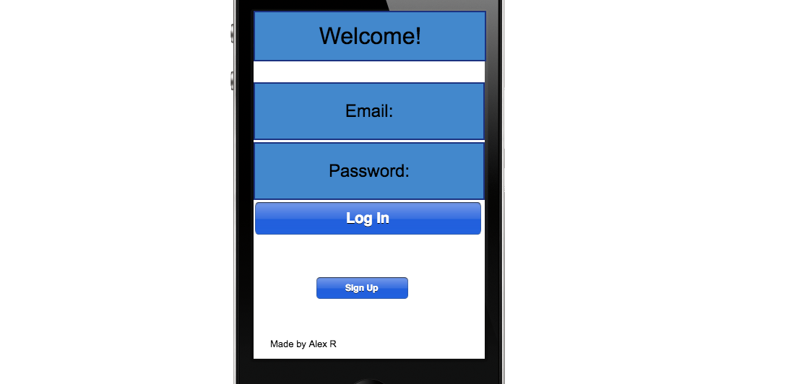

# Hit Messenger
WDI Final Project
Made by Alex Rosado

## Overview
A prototype messenging app that will allow users to engage in conversations with their friends.

## Wireframes
#### Login

#### Create Account
![Create Account]
(Wireframes/create_account_.png)

#### Home Page
![Home Page]
(Wireframes/homepage.png)

#### Conversation Page
![Conversation Page]
(Wireframes/conversationpage.png)

##### Chat Page
![Chat Page]
(Wireframes/chatpage.png)

### Technologies Used
* expo
* react-native
* firebase
* react-native-gifted-chat
* react-navigation

Expo is used to easily deploy React Native apps. Firebase is a database management service made by Google. React Navigation is used to create routes on React Native.

### How to install
Fork/clone this repo and run npm install. You'll either be able to use your phone to run it on expo or use an ios or android simulator to run the app.

### Future Features
* Add additional channels for group chat
* Being able to manually add friends
* Fully customize the layout
* Add the ability to send links and images
* Push notifications

## Credit

Big thanks to Aryaminus for assisting with how to link properly link firebase to my app.

Reference: https://github.com/aryaminus/RN-firechat

